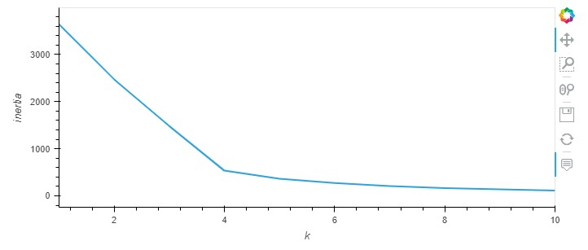
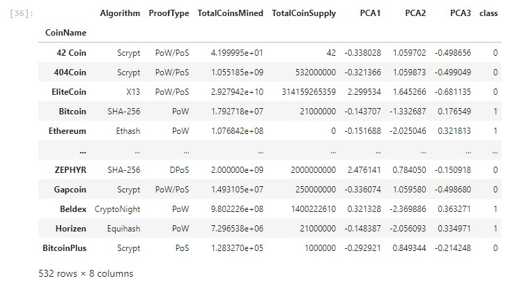
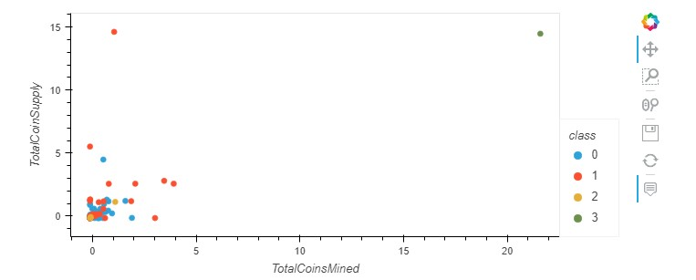
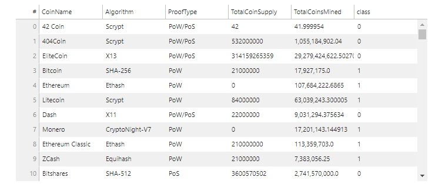
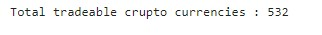

# Amazon Web Services
#### In order to cluster all the trade able crypto currencies , following steps were taken :
1. Importing all the necessary libraires and dependencies.
2. Retreiving the data in this case form the resource file.
3. Process the data, this includes dropping the null values and choosing the the coins that have a working algorithm and are currently being traded.
4. This manipulation of the data also includes converting the non-numeric values into binaries.
5. The next step is to reduce the number of features by usin PCA.
6. This follows an essential step, that is, finding the appropriate number of centroids or classes using elbow curve as illustrated by the attached image.

7. We used 4 centroids as a result of the aforementioned procedure.

8. In the next step we used 'total coins mined' and 'total supply' of the coins to make a scatter plot , after scaling the two data.\

9. Finally, we presented the data as a plotted dataframe , that includes trade-able crypto currencies.

10. To reiterate following are the total number of trade-able crypto currencies.

